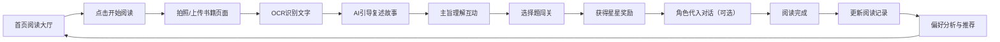

## 1. 产品概述

小书童AI阅读伙伴是一款面向6-12岁小学生的AI阅读理解与表达陪伴工具。孩子通过拍照上传当天阅读内容，AI以萌趣可爱的角色形象引导孩子复述故事、理解主旨，通过选择题闯关、角色代入对话和趣味语音激发阅读讨论热情，同时记录孩子的阅读偏好，持续推荐更适合的阅读内容。

- **核心价值**：让阅读不再孤单，培养孩子的阅读理解能力和表达能力
- **目标用户**：6-12岁小学生及其家长
- **解决痛点**：孩子阅读后无人交流、阅读理解能力难以提升、缺乏持续阅读动力

## 2. 核心功能

### 2.1 用户角色

| 角色 | 注册方式 | 核心权限 |
|------|----------|----------|
| 小朋友用户 | 家长协助创建/昵称登录 | 阅读互动、答题闯关、角色对话、查看成就 |
| 家长用户 | 手机号/微信登录 | 查看孩子阅读报告、设置阅读计划、管理账号 |

### 2.2 功能模块

1. **首页（阅读大厅）**：今日阅读任务、我的书架、阅读成就、开始阅读入口
2. **阅读互动页**：拍照上传、AI对话引导、主旨理解、选择题闯关、角色代入
3. **阅读记录页**：阅读历史、偏好分析、书籍推荐、成长报告
4. **个人中心**：我的成就、虚拟形象装扮、设置

### 2.3 页面详情

| 页面名称 | 模块名称 | 功能描述 |
|----------|----------|----------|
| 首页（阅读大厅） | 顶部欢迎区 | 显示小朋友昵称、当前等级、今日阅读时长、萌趣吉祥物问候 |
| 首页（阅读大厅） | 今日任务卡片 | 展示今日推荐书籍、阅读目标进度、"开始阅读"大按钮 |
| 首页（阅读大厅） | 我的书架 | 横向滑动展示已读书籍封面，带阅读进度条 |
| 首页（阅读大厅） | 成就勋章墙 | 展示获得的勋章（阅读小达人、故事大王等），未获得的灰色显示 |
| 首页（阅读大厅） | 底部导航 | 首页、阅读、记录、我的 四个Tab |
| 阅读互动页 | 拍照上传区 | 相机/相册按钮，支持拍摄书籍页面，OCR文字识别预览 |
| 阅读互动页 | AI角色对话区 | 可爱的小书童形象，气泡式对话，引导复述故事内容 |
| 阅读互动页 | 主旨理解模块 | AI用简单语言总结故事主旨，孩子点头/摇头反馈理解度 |
| 阅读互动页 | 选择题闯关 | 3-5道趣味选择题，答对有动画奖励，答错温柔提示再试 |
| 阅读互动页 | 角色代入模式 | 选择故事中的角色，与AI进行角色扮演对话 |
| 阅读互动页 | 语音按钮 | 支持语音输入回答，AI用萌趣语音回复 |
| 阅读记录页 | 阅读日历 | 日历形式展示每日阅读情况，打卡连续天数 |
| 阅读记录页 | 偏好分析图表 | 饼图展示喜欢的书籍类型（童话/科普/历史等） |
| 阅读记录页 | 智能推荐 | 根据偏好推荐适合的书籍，带推荐理由 |
| 阅读记录页 | 成长报告 | 阅读时长、理解能力提升曲线、表达能力评分 |
| 个人中心 | 虚拟形象 | 可换装的小书童形象，用阅读币解锁装扮 |
| 个人中心 | 我的成就 | 全部勋章列表，阅读等级进度 |
| 个人中心 | 设置 | 语音开关、字体大小、家长模式入口 |

## 3. 核心流程

小朋友打开App，首页吉祥物热情打招呼，点击"开始阅读"按钮，选择拍照上传今天读的书籍页面。AI识别文字后，小书童用可爱的语气引导孩子用自己的话复述故事。复述完成后，AI总结故事主旨并询问孩子是否理解。接着进入选择题闯关环节，孩子答题获得星星奖励。闯关成功后可以选择角色代入模式，扮演故事中的角色和AI对话。阅读结束后，系统记录本次阅读数据，更新阅读偏好，并在记录页展示成长报告和推荐新书。

## 4. 用户界面设计

### 4.1 设计风格

- **主色调**：温暖的奶油黄 `#FFE8A3` + 清新薄荷绿 `#A8E6CF` + 柔和天空蓝 `#B8E0F2`
- **辅助色**：蜜桃粉 `#FFB7B2`、淡紫 `#E0BBE4`、胡萝卜橙 `#FFDAC1`
- **按钮风格**：超大圆角（20-24px）、柔和阴影、点击有弹跳动画
- **字体**：圆润可爱的中文字体，标题使用略带卡通感的字体，正文清晰易读
- **布局风格**：卡片式布局，大量圆角和柔和阴影，元素间距宽松
- **图标风格**：手绘风格emoji和卡通图标，色彩鲜艳
- **吉祥物**：一只戴着小眼镜、围着围巾的可爱小猫头鹰"书书"，作为AI助手形象

### 4.2 页面设计概述

| 页面名称 | 模块名称 | UI元素 |
|----------|----------|--------|
| 首页 | 欢迎区 | 渐变背景、吉祥物大头像、跳动的问候文字、等级徽章 |
| 首页 | 任务卡片 | 圆角卡片、书籍封面插图、进度条动画、发光按钮 |
| 首页 | 书架 | 横向滚动、书籍封面悬浮效果、进度标签 |
| 首页 | 勋章墙 | 网格布局、金色/灰色勋章、hover放大效果 |
| 阅读互动页 | 对话区 | 聊天气泡、小书童形象动画、打字机效果、语音波形 |
| 阅读互动页 | 选择题 | 卡片式选项、选中动画、正确/错误反馈特效 |
| 阅读互动页 | 角色选择 | 圆形角色头像、发光选中效果、角色名称标签 |
| 记录页 | 日历 | 彩色日期格子、打卡标记、连续天数高亮 |
| 记录页 | 偏好图表 | 彩色饼图、动画填充、类型标签 |
| 个人中心 | 虚拟形象 | 大尺寸形象展示、换装按钮、衣橱入口 |

### 4.3 响应式设计

- 采用移动优先设计，同时适配平板和桌面端
- 手机端：单列布局，底部导航，大按钮便于触控
- 平板端：两列布局，内容区域更宽敞
- 桌面端：侧边导航，内容区域居中最大宽度限制
- 所有交互元素保证最小44x44px触控区域
- 支持横屏模式，对话区域自适应高度

### 4.4 动效与交互

- 页面切换：柔和的淡入淡出+轻微滑动
- 吉祥物：眨眼、点头、摇晃等Idle动画
- 答对题目：星星爆炸特效、小书童欢呼动画
- 按钮点击：缩放弹跳效果（scale 0.95 → 1.05 → 1）
- 消息气泡：从下往上滑入+轻微弹性
- 进度条：平滑填充动画
- 勋章获得：金光闪烁+飘落彩带特效
