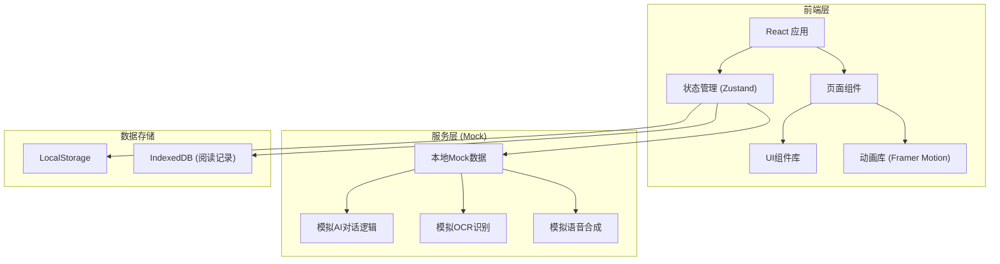
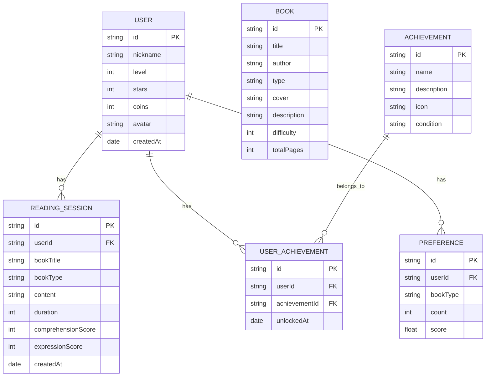

## 1. 架构设计



## 2. 技术描述

- **前端框架**：React@18 + TypeScript + Vite
- **样式方案**：TailwindCSS@3 + CSS变量主题系统
- **状态管理**：Zustand（轻量级，适合快速开发）
- **路由方案**：React Router v6
- **动画库**：Framer Motion（丰富的交互动画）
- **图标方案**：Lucide React + 自定义emoji图标
- **图表库**：Recharts（阅读数据可视化）
- **构建工具**：Vite 5
- **后端**：无（前端Mock模拟所有服务）
- **数据存储**：LocalStorage + IndexedDB（本地持久化）

## 3. 路由定义

| 路由 | 页面 | 用途 |
|------|------|------|
| `/` | 首页（阅读大厅） | 展示今日任务、书架、成就、入口 |
| `/reading` | 阅读互动页 | 拍照上传、AI对话、答题、角色扮演 |
| `/records` | 阅读记录页 | 阅读日历、偏好分析、智能推荐 |
| `/profile` | 个人中心 | 虚拟形象、成就勋章、设置 |

## 4. 数据模型

### 4.1 数据模型定义



### 4.2 类型定义

```typescript
// 用户信息
interface User {
  id: string;
  nickname: string;
  level: number;
  stars: number;
  coins: number;
  avatar: string;
  outfit?: string;
  createdAt: string;
}

// 阅读会话
interface ReadingSession {
  id: string;
  userId: string;
  bookTitle: string;
  bookType: BookType;
  content: string;
  duration: number;
  comprehensionScore: number;
  expressionScore: number;
  questionsAnswered: number;
  correctAnswers: number;
  rolePlayed?: string;
  createdAt: string;
}

// 书籍类型
type BookType = 'fairy_tale' | 'science' | 'history' | 'fable' | 'poetry' | 'adventure';

// 书籍
interface Book {
  id: string;
  title: string;
  author: string;
  type: BookType;
  cover: string;
  description: string;
  difficulty: 1 | 2 | 3 | 4 | 5;
  totalPages: number;
  sampleContent: string;
}

// 成就
interface Achievement {
  id: string;
  name: string;
  description: string;
  icon: string;
  condition: string;
  requirement: number;
}

// 选择题
interface QuizQuestion {
  id: string;
  question: string;
  options: string[];
  correctIndex: number;
  explanation: string;
}

// 对话消息
interface ChatMessage {
  id: string;
  role: 'ai' | 'user';
  content: string;
  type: 'text' | 'voice' | 'quiz' | 'roleplay';
  timestamp: string;
}

// 阅读偏好
interface Preference {
  bookType: BookType;
  count: number;
  score: number;
}

// 推荐书籍
interface RecommendedBook extends Book {
  reason: string;
  matchScore: number;
}
```

## 5. 前端目录结构

```
src/
├── components/          # 公共组件
│   ├── Layout/         # 布局组件（底部导航、头部）
│   ├── Mascot/         # 吉祥物组件（猫头鹰书书）
│   ├── ChatBubble/     # 聊天气泡组件
│   ├── BookCard/       # 书籍卡片
│   ├── Badge/          # 勋章组件
│   ├── ProgressBar/    # 进度条组件
│   └── Button/         # 自定义按钮
├── pages/              # 页面组件
│   ├── Home/           # 首页
│   ├── Reading/        # 阅读互动页
│   ├── Records/        # 记录页
│   └── Profile/        # 个人中心
├── store/              # 状态管理
│   ├── useUserStore.ts    # 用户状态
│   ├── useReadingStore.ts # 阅读状态
│   └── useUistore.ts      # UI状态
├── mock/               # Mock数据
│   ├── books.ts        # 书籍数据
│   ├── achievements.ts # 成就数据
│   ├── aiResponses.ts  # AI对话回复
│   └── quizzes.ts      # 选择题库
├── hooks/              # 自定义hooks
│   ├── useAIChat.ts    # AI对话hook
│   ├── useVoice.ts     # 语音相关hook
│   └── useAchievement.ts # 成就检测hook
├── utils/              # 工具函数
│   ├── storage.ts      # 本地存储
│   ├── date.ts         # 日期处理
│   └── recommendation.ts # 推荐算法
├── types/              # 类型定义
│   └── index.ts
├── App.tsx
├── main.tsx
└── index.css
```

## 6. 核心功能实现方案

### 6.1 AI对话模拟
- 基于预设的对话模板和关键词匹配
- 根据书籍类型生成不同风格的引导语
- 模拟打字机效果逐字显示回复
- 支持多轮对话上下文

### 6.2 选择题系统
- 根据书籍内容自动关联对应题库
- 答题后即时反馈（正确/错误动画）
- 记录答题正确率，计入理解能力评分

### 6.3 角色代入模式
- 预设故事角色及其性格特点
- 角色专属对话风格和台词
- 用户可选择不同角色进行互动

### 6.4 阅读偏好分析
- 统计不同类型书籍的阅读频次
- 结合答题正确率计算偏好权重
- 基于偏好评分生成个性化推荐

### 6.5 成就系统
- 预设多种成就条件（阅读天数、答题正确率等）
- 实时检测成就解锁条件
- 解锁成就时有动画特效
